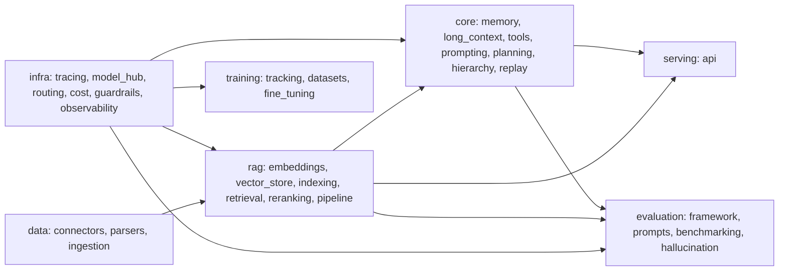

# Backlog: module assignments

One assignment per module of `src/llm_agents/`. Each file is a self-contained brief that
will be promoted into a request (`tasks/inbox/request-NNN.md`), which then activates the
pipeline described in `CLAUDE.md` (Analyst -> Decomposer -> Architect -> Planner -> Critic
-> Spec writer -> Test designer -> Environment -> Implementer -> Reviewer -> Tester).

Interface sketches inside each brief are hints to orient the Architect, not final designs.
The design is decided inside the pipeline, not in these files.

## How to promote a brief into a request

1. Pick the next brief by suggested order (respect dependencies below).
2. Copy its content into a new `tasks/inbox/request-NNN.md` (use the next free NNN).
3. Start the pipeline: `@agent:analyst -- implement <module> per backlog/<file>`.
4. The Analyst refines goal/scope/open-questions; the Decomposer creates the task card(s).

Most modules use Implementer: Python. ML-heavy modules (fine-tuning, datasets, and the
model/embedding/reranker-backed work) use Implementer: ML — noted in those briefs.

## Assignments by layer

### infra — runtime infrastructure
| # | Module | File | Depends on |
|---|---|---|---|
| 1 | Tracing | `01-infra-tracing.md` | — |
| 2 | Observability | `02-infra-observability.md` | tracing |
| 14 | Model hub | `14-infra-model_hub.md` | tracing |
| 3 | Inference routing | `03-infra-inference_routing.md` | tracing (uses model_hub) |
| 4 | Cost/latency optimization | `04-infra-cost_latency_optimization.md` | inference_routing, tracing |
| 15 | Guardrails | `15-infra-guardrails.md` | tracing (soft: embeddings, routing) |

### data — ingestion
| # | Module | File | Depends on |
|---|---|---|---|
| 16 | Connectors | `16-data-connectors.md` | tracing |
| 17 | Parsers | `17-data-parsers.md` | — |
| 18 | Ingestion | `18-data-ingestion.md` | connectors, parsers, rag/indexing |

### rag — retrieval-augmented generation
| # | Module | File | Depends on |
|---|---|---|---|
| 19 | Embeddings | `19-rag-embeddings.md` | model_hub, tracing |
| 20 | Vector store | `20-rag-vector_store.md` | tracing |
| 21 | Indexing | `21-rag-indexing.md` | long_context, embeddings, vector_store |
| 22 | Retrieval | `22-rag-retrieval.md` | embeddings, vector_store |
| 23 | Reranking | `23-rag-reranking.md` | model_hub |
| 24 | Pipeline | `24-rag-pipeline.md` | retrieval, reranking, prompting, routing, guardrails |

### core — agent capabilities
| # | Module | File | Depends on |
|---|---|---|---|
| 5 | Agent memory | `05-core-agent_memory.md` | (soft) long_context, tracing |
| 6 | Long-context handling | `06-core-long_context.md` | inference_routing, tracing |
| 7 | Tool orchestration | `07-core-tool_orchestration.md` | tracing |
| 25 | Prompting | `25-core-prompting.md` | long_context (soft: embeddings) |
| 8 | Planning | `08-core-planning.md` | agent_memory, tool_orchestration, long_context, routing |
| 9 | Hierarchical agents | `09-core-hierarchical_agents.md` | planning, tool_orchestration, agent_memory |
| 10 | Replay analysis | `10-core-replay_analysis.md` | tracing (soft: evaluation/framework) |

### serving — HTTP
| # | Module | File | Depends on |
|---|---|---|---|
| 26 | API | `26-serving-api.md` | core/*, rag/pipeline, routing, guardrails |

### training — offline MLOps
| # | Module | File | Depends on |
|---|---|---|---|
| 29 | Experiment tracking | `29-training-experiment_tracking.md` | — |
| 28 | Datasets | `28-training-datasets.md` | (soft) experiment_tracking |
| 27 | Fine-tuning | `27-training-fine_tuning.md` | datasets, experiment_tracking, model_hub |

### evaluation — offline evaluation
| # | Module | File | Depends on |
|---|---|---|---|
| 11 | Evaluation framework | `11-evaluation-framework.md` | core/*, routing, tracing |
| 12 | Prompt evaluation | `12-evaluation-prompts.md` | evaluation/framework, routing |
| 13 | Benchmarking | `13-evaluation-benchmarking.md` | evaluation/framework, core/*, replay_analysis |
| 30 | Hallucination detection | `30-evaluation-hallucination.md` | evaluation/framework (soft: retrieval, routing) |

## Suggested build order

Build bottom-up along the runtime dependency direction, then the offline layers:

Within a layer, modules without an edge between them can proceed in parallel. The numbered
suggested order inside each brief gives a safe sequential path.
