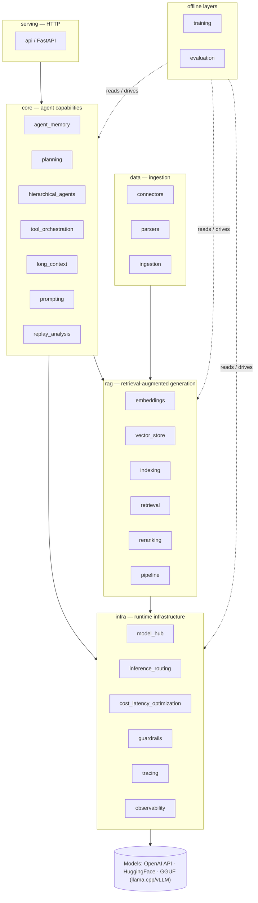
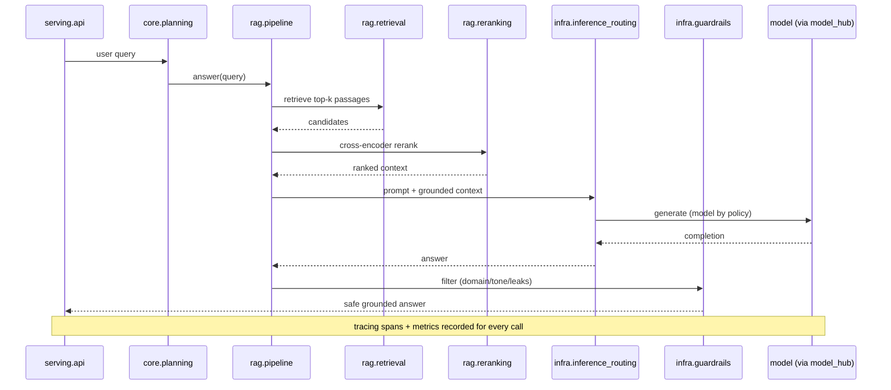

# llm_agents_system

A Python platform for building and orchestrating LLM-based agent systems. It combines model
management, retrieval-augmented generation, agent orchestration, evaluation, and serving
into composable, independently testable subsystems.

The core stays dependency-light. Heavy integrations — local inference, RAG backends,
fine-tuning, serving, data connectors — live behind thin interfaces and are opt-in via
[optional extras](#optional-extras), so a default install pulls almost nothing and tests
run against mocked boundaries.

---

## Problem

Building a single LLM call is easy. Building a *platform* of agents that stays correct,
grounded, observable, and affordable is not. Real deployments hit the same recurring
problems:

- **Many model backends.** Hosted APIs (OpenAI), local HuggingFace models, and quantized
  GGUF models (llama.cpp, vLLM) all behave differently and need versioning.
- **Grounding.** Free-running LLMs hallucinate. Answers must be grounded in internal
  knowledge (Confluence, Jira, docs) via retrieval, not the model's parametric memory.
- **Statefulness.** Agents need working and long-term memory that outlives a request
  without overflowing the context window.
- **Decomposition & tool use.** Non-trivial goals must be split, delegated, and executed
  through tools, safely.
- **Cost & latency.** Inference dominates both. Routing cheaper models for easy tasks,
  caching, and batching keep cost sub-linear to traffic.
- **Safety.** Outputs must stay on-domain, on-tone, and free of sensitive content.
- **Observability & reproducibility.** You need traces and metrics to see *why* an agent
  behaved as it did, and recorded runs to reproduce non-deterministic behavior.
- **Evaluation & iteration.** Prompt and model changes need measurement (consistency,
  BLEU/ROUGE/F1, hallucination rate), and improving a model needs a fine-tuning loop.

This project factors each concern into an independent, testable subsystem.

---

## Architecture

Subsystems are grouped into layers with a strict dependency direction. Runtime layers flow
infra → data → rag → core → serving. Offline layers (training, evaluation) depend on the
runtime layers, but nothing in the runtime path depends on them.



### Request flow (grounded RAG answer)



### Subsystems

#### `infra/` — runtime infrastructure

| Subsystem | Package | Responsibility |
|---|---|---|
| Model hub | `infra/model_hub/` | Load/version models across OpenAI, HuggingFace, GGUF (llama.cpp/vLLM); MLflow versioning |
| Inference routing | `infra/inference_routing/` | Route across providers/models by policy (e.g. GPT-4 for generation, Mistral for classification) |
| Cost/latency optimization | `infra/cost_latency_optimization/` | Caching, batching, model-tier selection, budget tracking |
| Guardrails | `infra/guardrails/` | Output filtering and tone/compliance enforcement (regex/embedding + optional NeMo) |
| Tracing system | `infra/tracing/` | Structured spans across agent, tool, and LLM calls |
| Observability | `infra/observability/` | Metrics, logging, dashboards |

#### `data/` — ingestion

| Subsystem | Package | Responsibility |
|---|---|---|
| Connectors | `data/connectors/` | Pull from PostgreSQL, Confluence, Jira, Google Drive |
| Parsers | `data/parsers/` | Extract text from PDF, DOCX, custom formats |
| Ingestion | `data/ingestion/` | Continuous pull → parse → chunk → embed pipeline |

#### `rag/` — retrieval-augmented generation

| Subsystem | Package | Responsibility |
|---|---|---|
| Embeddings | `rag/embeddings/` | sentence-transformers or provider embeddings behind an interface |
| Vector store | `rag/vector_store/` | FAISS, pgvector, Weaviate, Chroma, Elasticsearch adapters |
| Indexing | `rag/indexing/` | Chunk → embed → upsert documents |
| Retrieval | `rag/retrieval/` | Dense passage retrieval |
| Reranking | `rag/reranking/` | Cross-encoder reranking |
| Pipeline | `rag/pipeline/` | Retrieve → (rerank) → generate grounded answers |

#### `core/` — agent capabilities

| Subsystem | Package | Responsibility |
|---|---|---|
| Agent memory | `core/agent_memory/` | Short/long-term memory; vector buffers (Redis, Chroma) |
| Planning systems | `core/planning/` | Decompose goals into executable steps |
| Hierarchical agents | `core/hierarchical_agents/` | Supervisor/worker delegation and coordination |
| Tool orchestration | `core/tool_orchestration/` | Tool registry, dispatch, execution |
| Long-context handling | `core/long_context/` | Chunking, summarization, retrieval over large contexts |
| Prompting | `core/prompting/` | Dynamic few-shot prompt templates |
| Replay-analysis agents | `core/replay_analysis/` | Analyze recorded run traces |

#### `serving/` — HTTP

| Subsystem | Package | Responsibility |
|---|---|---|
| API | `serving/api/` | FastAPI services exposing orchestration, RAG, and chat |

#### `training/` — offline MLOps

| Subsystem | Package | Responsibility |
|---|---|---|
| Fine-tuning | `training/fine_tuning/` | Parameter-efficient fine-tuning (Transformers + PEFT) |
| Datasets | `training/datasets/` | Annotation (Prodigy), storage (Delta Lake / DVC) |
| Experiment tracking | `training/experiment_tracking/` | MLflow / Weights & Biases / DVC |

#### `evaluation/` — offline evaluation

| Subsystem | Package | Responsibility |
|---|---|---|
| Evaluation framework | `evaluation/framework/` | Metrics (incl. BLEU/ROUGE/F1), harnesses, scoring |
| Prompt evaluation | `evaluation/prompts/` | Compare prompt variants; consistency tests |
| Benchmarking | `evaluation/benchmarking/` | Run agents against task suites; aggregate results |
| Hallucination detection | `evaluation/hallucination/` | Compare generations against ground-truth snippets |

### Project layout

```
llm_agents_system/
  src/llm_agents/
    infra/      model_hub, inference_routing, cost_latency_optimization, guardrails, tracing, observability
    data/       connectors, parsers, ingestion
    rag/        embeddings, vector_store, indexing, retrieval, reranking, pipeline
    core/       agent_memory, planning, hierarchical_agents, tool_orchestration, long_context, prompting, replay_analysis
    serving/    api
    training/   fine_tuning, datasets, experiment_tracking
    evaluation/ framework, prompts, benchmarking, hallucination
    config.py   typed runtime settings (env + configs/)
  tests/        pytest suite (unit/, integration/, fixtures/)
  configs/      runtime + observability config
  deploy/       Dockerfile, docker-compose.yml, .dockerignore
  .github/workflows/ CI (lint + test)
  pyproject.toml     metadata, deps, optional extras, ruff + pytest config (uv)
  .cursor/      multi-agent development pipeline
  CLAUDE.md     entry point for agents working in this repo
```

---

## Design decisions (why)

| Decision | Rationale |
|---|---|
| **Thin interfaces + adapters, heavy deps as optional extras** | The framework owns interfaces (`ModelBackend`, `VectorStore`, `Retriever`, `Embedder`); concrete frameworks (LangChain, Haystack, vLLM, NeMo) are pluggable adapters. Keeps the default install light, avoids vendor lock-in, and keeps the provider boundary mockable in tests. |
| **Layered groups with a strict dependency direction** | infra → data → rag → core → serving for runtime; training/evaluation are offline and depend on the rest. Prevents offline/eval code leaking into the runtime path. |
| **Support multiple model backends behind one hub** | OpenAI, HuggingFace, and GGUF (llama.cpp/vLLM) have different ops profiles; one `model_hub` + routing policy lets callers pick the right model per task. |
| **RAG-first grounding** | Hallucination is the dominant failure mode; grounding answers in retrieved internal docs is more reliable (and cheaper) than fine-tuning for knowledge. |
| **Reproducibility via recorded traces** | LLM outputs are non-deterministic, so reproducibility comes from recording/replaying traces (`core/replay_analysis`), not bit-identical output. A `seed` fixes only non-LLM randomness. |
| **uv + committed `uv.lock`** | Fast, reproducible installs; the lockfile pins exact versions for CI and every developer. |
| **`src/` layout, mock the provider boundary** | Tests run against the installed package; unit tests never make real network/model calls. |

> Note: this supersedes the earlier "external APIs only, no local inference" scope. Local
> inference and fine-tuning are now in scope, but isolated behind the `local-inference` and
> `training` extras so they don't burden the default install.

---

## Tradeoffs

- **Breadth vs. focus.** The platform spans ingestion → RAG → agents → serving → MLOps.
  Optional extras and strict layering keep that breadth from becoming a monolith, but the
  surface area is large.
- **Multiple backends vs. simplicity.** Supporting OpenAI + HF + GGUF + several vector
  stores means more adapters to maintain; the interface seam is the price of avoiding
  lock-in.
- **Local inference: control vs. ops cost.** vLLM/llama.cpp remove per-token API cost and
  keep data in-house, at the cost of GPU/CPU capacity and heavier dependencies (hence
  opt-in).
- **RAG vs. fine-tuning for knowledge.** RAG is cheaper to keep fresh; fine-tuning suits
  style/format adaptation. Both are supported; choosing per use case is on the caller.
- **Caching probabilistic outputs.** Saves cost/latency but risks staleness, so caching is
  opt-in per call.
- **Framework adapters vs. native use.** Wrapping LangChain/Haystack behind our interfaces
  costs a thin layer but buys testability and swappability.

---

## Scaling concerns

- **I/O- and GPU-bound.** Hosted calls are network-bound; local inference is GPU-bound.
  Design for async/concurrent I/O on the hot path and a separate inference tier for local
  models.
- **Vector index size.** Corpora grow; choose a vector store that scales (pgvector/Weaviate
  for large, FAISS for local) and shard/replicate as needed.
- **Token & context budgets.** `long_context` must chunk/summarize before overflow;
  retrieval must pack the most relevant context into the budget.
- **Cost ceilings.** Routing, caching, and batching (`cost_latency_optimization`) keep cost
  sub-linear; budgets are tracked per request.
- **Rate limits & failover.** `inference_routing` handles retries, backoff, and failover
  across providers/models.
- **Stateless serving + external state.** `serving` stays stateless; memory and vector
  indexes live in external backends for horizontal scaling.
- **Ingestion throughput.** Continuous ingestion must batch embedding calls and dedupe to
  avoid re-embedding unchanged documents.
- **Observability volume.** Per-call spans/metrics grow fast; use sampling and retention
  policies.

---

## Benchmarks

> [WARNING] The benchmarking harness (`evaluation/benchmarking/`) is scaffolded but task
> suites are not yet implemented. The table below defines the metrics and targets we intend
> to measure — values are **not yet measured** and must not be cited as results.

Planned methodology: run a fixed task suite through an agent/RAG configuration, record
traces, and aggregate per-run metrics. Runs are reproducible by replaying recorded traces
instead of re-calling providers.

| Metric | Definition | Target | Status |
|---|---|---|---|
| Task success rate | Fraction of suite tasks completed correctly | — | not measured |
| Groundedness | Fraction of answers supported by retrieved context | — | not measured |
| Hallucination rate | Fraction of answers contradicting ground-truth snippets | — | not measured |
| BLEU / ROUGE / F1 | Overlap with reference answers | — | not measured |
| Tokens / task | Mean total tokens per completed task | — | not measured |
| Latency p50 / p95 | Wall-clock per task | — | not measured |
| Cost / task | Mean USD per completed task | — | not measured |
| Cache hit rate | Fraction of completions served from cache | — | not measured |

```bash
# placeholder — CLI not yet implemented
uv run python -m llm_agents.evaluation.benchmarking --suite <name>
```

---

## Future improvements

- Concrete model-backend adapters (OpenAI, HF, llama.cpp, vLLM) behind `model_hub`.
- Async inference client and concurrent step execution.
- Reference vector-store adapters (FAISS local + pgvector server) and an embeddings adapter.
- End-to-end RAG pipeline wiring ingestion → indexing → retrieval → reranking → generation.
- Guardrails: ship default regex/embedding filters; add a NeMo Guardrails adapter.
- Fine-tuning loop (PEFT) with MLflow model registry and DVC/Delta Lake data versioning.
- FastAPI serving app with chat + RAG endpoints (replacing the placeholder Docker `CMD`).
- Real benchmark suites + reporting CLI; publish measured numbers.
- Hard budget enforcement (per-request and per-tenant).

---

## Getting started

Requires Python 3.12+ and [uv](https://docs.astral.sh/uv/).

```bash
# Install project + dev dependencies (light — no heavy ML/RAG deps)
uv sync --extra dev

# Run the test suite
uv run pytest

# Lint and format
uv run ruff check .
uv run ruff format .

# Verify the package imports
uv run python -c "import llm_agents; print('ok')"
```

### Optional extras

Install only what a given task needs:

```bash
uv sync --extra rag               # embeddings + local vector index (faiss, sentence-transformers)
uv sync --extra local-inference   # llama.cpp / vLLM local model backends
uv sync --extra training          # transformers + PEFT + MLflow fine-tuning
uv sync --extra serving           # FastAPI + uvicorn
uv sync --extra data              # PostgreSQL, Confluence/Jira, PDF/DOCX connectors/parsers
uv sync --extra tracking          # Weights & Biases + DVC
```

### Containers

```bash
# Build and run with an observability backend (OTel collector, Prometheus, Grafana)
docker compose -f deploy/docker-compose.yml up --build
```

### Reproducibility

- `uv.lock` pins exact dependency versions (committed).
- LLM outputs are non-deterministic; reproducible runs come from recorded traces stored
  under `tests/fixtures/traces/` and replayed via `core/replay_analysis/`.
- `LLM_AGENTS_SEED` fixes any non-LLM randomness (sampling, shuffling).

---

## Development pipeline

This repo ships with a file-based multi-agent development workflow under `.cursor/`
(request -> design -> spec -> tests -> implementation -> review). Agents read `CLAUDE.md`
first. Per-module assignments to drive that pipeline live in `.cursor/tasks/backlog/`.

- `CLAUDE.md` — entry point and non-negotiable rules
- `.cursor/pipeline/pipeline.md` — full pipeline definition
- `.cursor/tasks/backlog/` — one assignment per module, promoted into requests
- `.cursor/memory/status.md` — state of the project memory files

---

## Conventions

- English-only across all files. No emojis. Use markers: `[CRITICAL] [WARNING] [OK] [ERROR] [BLOCKING]`.
- Heavy/third-party integrations sit behind interfaces and optional extras, not in the core path.
- Unit tests must mock the model/provider boundary; no real network or model calls in unit tests.
