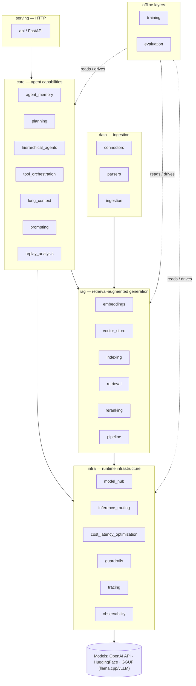
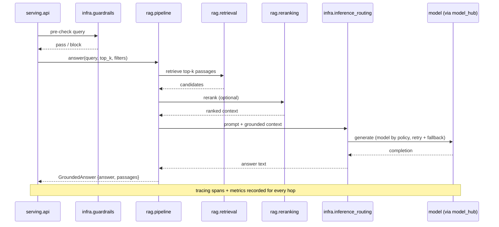

# llm_agents_system

A Python platform for building and orchestrating LLM-based agent systems. It combines model
management, retrieval-augmented generation, agent orchestration, evaluation, and serving
into composable, independently testable subsystems.

The core stays dependency-light. Heavy integrations — local inference, RAG backends,
fine-tuning, serving, data connectors — live behind thin interfaces and are opt-in via
[optional extras](#optional-extras), so a default install pulls almost nothing and tests
run against mocked boundaries.

**Quick links:** [Install](#getting-started) · [API + recipes](#usage) · [Architecture](#architecture) · [Module docs](docs/index.md)

---

## Documentation

Full per-module documentation lives in [`docs/`](docs/):

- [`docs/index.md`](docs/index.md) — system architecture overview, layer diagram, end-to-end
  data flow diagrams, and an index of all module docs
- [`docs/infra/`](docs/infra/) — tracing, observability, inference_routing,
  cost_latency_optimization, model_hub, guardrails
- [`docs/core/`](docs/core/) — agent_memory, long_context, tool_orchestration, planning,
  hierarchical_agents, replay_analysis, prompting
- [`docs/data/`](docs/data/) — connectors, parsers, ingestion
- [`docs/rag/`](docs/rag/) — embeddings, vector_store, indexing, retrieval, reranking, pipeline
- [`docs/evaluation/`](docs/evaluation/) — framework, prompts, benchmarking, hallucination
- [`docs/training/`](docs/training/) — fine_tuning, datasets, experiment_tracking
- [`docs/serving/`](docs/serving/) — api

Each file covers: public API, architecture (conceptual view + data flow), design decisions,
tradeoffs, scaling concerns, future improvements, and usage examples.

---

## Motivation

Building a single LLM call is easy. Building a *platform* of agents that stays correct,
grounded, observable, and affordable is not. Real deployments hit the same recurring
problems:

- **Many model backends.** Hosted APIs (OpenAI), local HuggingFace models, and quantized
  GGUF models (llama.cpp, vLLM) all behave differently and need versioning.
- **Grounding.** Free-running LLMs hallucinate. Answers must be grounded in internal
  knowledge (Confluence, Jira, docs) via retrieval, not the model's parametric memory.
- **Statefulness.** Agents need working and long-term memory that outlives a request
  without overflowing the context window.
- **Decomposition & tool use.** Non-trivial goals must be split, delegated, and executed
  through tools, safely.
- **Cost & latency.** Inference dominates both. Routing cheaper models for easy tasks,
  caching, and batching keep cost sub-linear to traffic.
- **Safety.** Outputs must stay on-domain, on-tone, and free of sensitive content.
- **Observability & reproducibility.** You need traces and metrics to see *why* an agent
  behaved as it did, and recorded runs to reproduce non-deterministic behavior.
- **Evaluation & iteration.** Prompt and model changes need measurement (consistency,
  BLEU/ROUGE/F1, hallucination rate), and improving a model needs a fine-tuning loop.

This project factors each concern into an independent, testable subsystem.

---

## Architecture

Subsystems are grouped into layers with a strict dependency direction. Runtime layers flow
infra → data → rag → core → serving. Offline layers (training, evaluation) depend on the
runtime layers, but nothing in the runtime path depends on them.

```
+------------------------------------------------------------------+
|  serving layer                                                   |
|  FastAPI application — /health  /chat  /rag/answer               |
+------------------------------------------------------------------+
         |                            |
         v                            v
+------------------+      +--------------------------+
|  core layer      |      |  rag layer               |
|  agent_memory    |      |  pipeline                |
|  long_context    |      |    retrieval             |
|  tool_orchestrat.|      |    reranking             |
|  planning        |      |    embeddings            |
|  hierarchical    |      |    vector_store          |
|  replay_analysis |      |    indexing              |
|  prompting       |      +-----------+--------------+
+------------------+                  |
                                      v
                         +--------------------------+
                         |  data layer              |
                         |  ingestion               |
                         |    connectors            |
                         |    parsers               |
                         +--------------------------+

+------------------------------------------------------------------+
|  infra layer  (cross-cutting — used by every layer above)        |
|  tracing  observability  inference_routing  model_hub            |
|  cost_latency_optimization  guardrails                           |
+------------------------------------------------------------------+

+------------------------------------------------------------------+
|  training layer  (offline — separate from serving path)          |
|  fine_tuning  datasets  experiment_tracking                      |
+------------------------------------------------------------------+

+------------------------------------------------------------------+
|  evaluation layer  (offline + CI)                                |
|  framework  prompts  benchmarking  hallucination                 |
+------------------------------------------------------------------+
```

Interactive layer diagram (GitHub rendering):



### Request flow (grounded RAG answer)

Detailed step-by-step with actual class and method names:

```
HTTP client
    |
    | POST /rag/answer {query, top_k, filters}
    v
serving/api  (_routes.py — FastAPI handler)
    |
    | 1. guardrail chain — keyword/embedding pre-check
    v
rag/pipeline  (RagPipeline.answer)
    |
    | 2. retrieve top_k passages
    v
rag/retrieval  (DenseRetriever.retrieve)
    |
    | 3. embed query
    v
rag/embeddings  (Embedder.embed)
    |
    | 4. vector search
    v
rag/vector_store  (VectorStore.search — InMemoryVectorStore / FAISSVectorStore / PgVectorStore / WeaviateVectorStore / ChromaVectorStore / ElasticsearchVectorStore)
    |
    | 5. optional rerank
    v
rag/reranking  (Reranker.rerank)
    |
    | 6. generate grounded answer
    v
core/prompting  (PromptTemplate.format)
    |
    v
infra/inference_routing  (Router.complete — retry + fallback)
    |
    v
infra/model_hub  (Backend.generate)
    |
    | 7. cost + latency tracking
    v
infra/cost_latency_optimization  (BudgetTracker, CompletionCache)
    |
    | 8. tracing + metrics export
    v
infra/tracing + infra/observability
    |
    v
GroundedAnswer  {answer, passages}  --HTTP--> client
```

Sequence view:



### Offline ingestion and indexing flow

```
external source
    |
data/connectors  (Connector.fetch_since)
    |  Document(doc_id, content, source, metadata)
    v
data/parsers  (DocumentParser.parse)
    |  ParsedDocument(doc_id, text, metadata)
    v
data/ingestion  (IngestionPipeline.ingest)
    |  MD5 dedup at document level
    |  TextChunker.chunk -> list[str]
    v
rag/indexing  (Indexer.index)
    |  MD5 dedup at chunk level
    |  batch embed -> upsert with chunk_id = "doc_id#N"
    v
rag/vector_store  (VectorStore.upsert)
```

### Training / fine-tuning flow

```
training/datasets  (DatasetLoader.from_jsonl / from_prodigy / DeltaTableLoader.load)
    |  Dataset.split(train_ratio) -> (train, val)
    |  DvcDataVersioner.add / push / pull  [optional file versioning]
    v
training/fine_tuning  (FineTuner.run)
    |  trainer_factory -> train -> save -> get_metrics
    v
training/experiment_tracking  (Tracker.log_metrics / log_params)
    |  MLflowTracker (prod) | NoOpTracker | InMemoryTracker (tests)
    v
FineTuneResult(model_path, metrics, run_id, artifact_uri)
```

### Subsystems

#### `infra/` — runtime infrastructure

| Subsystem | Package | Responsibility | Doc |
|---|---|---|---|
| Model hub | `infra/model_hub/` | Load/version models across OpenAI, HuggingFace, GGUF (llama.cpp/vLLM); versioned checkpoint registration and rollback via `MLflowVersionLogger` | [model_hub](docs/infra/model_hub.md) |
| Inference routing | `infra/inference_routing/` | Route across providers/models by policy; retry + fallback | [inference_routing](docs/infra/inference_routing.md) |
| Cost/latency optimization | `infra/cost_latency_optimization/` | LRU cache, async batcher, budget tracker | [cost_latency_optimization](docs/infra/cost_latency_optimization.md) |
| Guardrails | `infra/guardrails/` | Keyword / embedding filter chain; `NeMoGuard` adapter for NVIDIA NeMo Guardrails | [guardrails](docs/infra/guardrails.md) |
| Tracing | `infra/tracing/` | Async-safe spans across agent, tool, and LLM calls | [tracing](docs/infra/tracing.md) |
| Observability | `infra/observability/` | Prometheus metrics, JSON structured logging, span bridge | [observability](docs/infra/observability.md) |

#### `data/` — ingestion

| Subsystem | Package | Responsibility | Doc |
|---|---|---|---|
| Connectors | `data/connectors/` | Cursor-based incremental fetch from any source | [connectors](docs/data/connectors.md) |
| Parsers | `data/parsers/` | Decode bytes/str; pluggable `ParserRegistry` | [parsers](docs/data/parsers.md) |
| Ingestion | `data/ingestion/` | fetch → MD5 dedup → parse → chunk → upsert pipeline | [ingestion](docs/data/ingestion.md) |

#### `rag/` — retrieval-augmented generation

| Subsystem | Package | Responsibility | Doc |
|---|---|---|---|
| Embeddings | `rag/embeddings/` | `Embedder` protocol; `FakeEmbedder`, `BatchEmbedder`, `SentenceTransformerEmbedder` (`rag`), `OpenAIEmbedder` (`openai`), `CohereEmbedder` (`cohere`) | [embeddings](docs/rag/embeddings.md) |
| Vector store | `rag/vector_store/` | Cosine-similarity search; `InMemoryVectorStore`, `FAISSVectorStore`, `PgVectorStore`, `WeaviateVectorStore`, `ChromaVectorStore`, `ElasticsearchVectorStore` | [vector_store](docs/rag/vector_store.md) |
| Indexing | `rag/indexing/` | chunk → MD5 dedup → batch embed → upsert | [indexing](docs/rag/indexing.md) |
| Retrieval | `rag/retrieval/` | Dense passage retrieval with metadata filtering | [retrieval](docs/rag/retrieval.md) |
| Reranking | `rag/reranking/` | Score-based reranking; `FakeReranker`, `ScoreReranker` | [reranking](docs/rag/reranking.md) |
| Pipeline | `rag/pipeline/` | retrieve → (rerank) → generate grounded answers | [pipeline](docs/rag/pipeline.md) |

#### `core/` — agent capabilities

| Subsystem | Package | Responsibility | Doc |
|---|---|---|---|
| Agent memory | `core/agent_memory/` | Short/long-term memory; scorer-based recall | [agent_memory](docs/core/agent_memory.md) |
| Planning | `core/planning/` | Decompose goals into executable steps; reactive replanning | [planning](docs/core/planning.md) |
| Hierarchical agents | `core/hierarchical_agents/` | Coordinator/worker delegation and coordination | [hierarchical_agents](docs/core/hierarchical_agents.md) |
| Tool orchestration | `core/tool_orchestration/` | Tool registry, sequential/parallel dispatch | [tool_orchestration](docs/core/tool_orchestration.md) |
| Long-context handling | `core/long_context/` | Sliding-window, summary, and topic-based strategies | [long_context](docs/core/long_context.md) |
| Prompting | `core/prompting/` | `PromptTemplate`, `FewShotTemplate`, `ExampleSelector` | [prompting](docs/core/prompting.md) |
| Replay analysis | `core/replay_analysis/` | Record and analyze agent run traces | [replay_analysis](docs/core/replay_analysis.md) |

#### `serving/` — HTTP

| Subsystem | Package | Responsibility | Doc |
|---|---|---|---|
| API | `serving/api/` | FastAPI app; `/health` `/chat` `/rag/answer`; Pydantic schemas | [api](docs/serving/api.md) |

#### `training/` — offline MLOps

| Subsystem | Package | Responsibility | Doc |
|---|---|---|---|
| Fine-tuning | `training/fine_tuning/` | `FineTuner` + `peft_trainer_factory` (default); `PeftTrainer` wraps HuggingFace Trainer; QLoRA via `use_4bit=True` | [fine_tuning](docs/training/fine_tuning.md) |
| Datasets | `training/datasets/` | `Dataset` (split, validate, version hash); Prodigy normaliser; `DeltaTableLoader` (Delta Lake, `delta-lake` extra); `DvcDataVersioner` (DVC CLI wrapper, `tracking` extra) | [datasets](docs/training/datasets.md) |
| Experiment tracking | `training/experiment_tracking/` | `Tracker` Protocol; `NoOpTracker`, `InMemoryTracker`; `MLflowTracker` (production MLflow adapter, `training` extra) | [experiment_tracking](docs/training/experiment_tracking.md) |

#### `evaluation/` — offline evaluation

| Subsystem | Package | Responsibility | Doc |
|---|---|---|---|
| Evaluation framework | `evaluation/framework/` | `EvalHarness`, `Metric` protocol, `EvalReport`, `aggregate` | [framework](docs/evaluation/framework.md) |
| Prompt evaluation | `evaluation/prompts/` | Compare prompt variants; `PromptComparison` | [prompts](docs/evaluation/prompts.md) |
| Benchmarking | `evaluation/benchmarking/` | Task suites, p95 latency, CLI entrypoint | [benchmarking](docs/evaluation/benchmarking.md) |
| Hallucination detection | `evaluation/hallucination/` | `OverlapDetector`, `LLMJudgeDetector`, `HallucinationReport` | [hallucination](docs/evaluation/hallucination.md) |

### Project layout

```
llm_agents_system/
  src/llm_agents/
    infra/
      tracing/                    Span, SpanContext, FinishedSpan, Tracer, InMemoryCollector
      observability/              MetricsRegistry, JSONFormatter, bridge_span
      inference_routing/          Router, RoutingPolicy, Candidate
      cost_latency_optimization/  CompletionCache, Batcher, BudgetTracker
      model_hub/                  ModelHub, ModelBackend (Protocol), OpenAIBackend,
                                  HuggingFaceBackend, LlamaCppBackend, VLLMBackend,
                                  MLflowVersionLogger
      guardrails/                 GuardrailChain, KeywordFilter, EmbeddingFilter, NeMoGuard
    data/
      connectors/                 Document, Connector (Protocol), FakeConnector
      parsers/                    ParsedDocument, DocumentParser (Protocol), TextParser, ParserRegistry
      ingestion/                  IngestionPipeline, IngestionReport
    rag/
      embeddings/                 Embedder (Protocol), FakeEmbedder, BatchEmbedder,
                                  SentenceTransformerEmbedder, OpenAIEmbedder, CohereEmbedder
      vector_store/               VectorStore (Protocol), InMemoryVectorStore, FAISSVectorStore,
                                  PgVectorStore, WeaviateVectorStore, ChromaVectorStore,
                                  ElasticsearchVectorStore, SearchResult
      indexing/                   Indexer, IndexReport
      retrieval/                  DenseRetriever, RetrievedPassage
      reranking/                  Reranker (Protocol), FakeReranker, ScoreReranker
      pipeline/                   RagPipeline, GroundedAnswer
    core/
      agent_memory/               Memory, MemoryEntry, ShortTermMemory, LongTermMemory
      long_context/               ContextManager (Protocol), SlidingWindowStrategy, SummaryStrategy
      tool_orchestration/         Tool (Protocol), ToolRegistry, ToolOrchestrator
      planning/                   Plan, Step, Planner (Protocol), SimplePlanner, ReactivePlanner
      hierarchical_agents/        AgentNode (Protocol), Coordinator, WorkerAgent
      replay_analysis/            Event, ReplaySession, ReplayAnalyzer
      prompting/                  PromptTemplate, FewShotTemplate, ExampleSelector
    serving/
      api/                        create_app, build_router, ChatRequest, RagRequest, HealthResponse
    training/
      fine_tuning/                FineTuner, FineTuneConfig, FineTuneResult,
                                  PeftTrainer, peft_trainer_factory
      datasets/                   Dataset, Example, DatasetLoader, from_prodigy,
                                  DeltaTableLoader, DvcDataVersioner
      experiment_tracking/        Tracker (Protocol), NoOpTracker, InMemoryTracker,
                                  MLflowTracker
    evaluation/
      framework/                  EvalCase, EvalResult, EvalReport, EvalHarness, Metric (Protocol)
      prompts/                    PromptVariant, VariantResult, PromptComparison, compare
      benchmarking/               BenchmarkTask, Suite, BenchmarkRunner, BenchmarkReport
      hallucination/              HallucinationReport, HallucinationDetector (Protocol), OverlapDetector, LLMJudgeDetector
    config.py                     typed runtime settings (env + configs/)
  tests/unit/                     mirrors src/ — one test file per module (1233 passing with --extra dev --extra rag --extra serving)
  docs/                           per-module documentation
    index.md                      system overview, layer diagram, all flow diagrams
    infra/                        6 module docs
    core/                         7 module docs
    data/                         3 module docs
    rag/                          6 module docs
    evaluation/                   4 module docs
    training/                     3 module docs
    serving/                      1 module doc
  configs/                        runtime + observability config
  deploy/                         Dockerfile, docker-compose.yml, .dockerignore
  .github/workflows/              CI (lint + test)
  pyproject.toml                  metadata, deps, optional extras, ruff + pytest config (uv)
  .cursor/                        multi-agent development pipeline
  CLAUDE.md                       entry point for agents working in this repo
```

---

## Design decisions (why)

| Decision | Rationale |
|---|---|
| **Thin interfaces + adapters, heavy deps as optional extras** | The framework owns interfaces (`ModelBackend`, `VectorStore`, `Retriever`, `Embedder`); concrete frameworks (LangChain, Haystack, vLLM, NeMo) are pluggable adapters. Keeps the default install light, avoids vendor lock-in, and keeps the provider boundary mockable in tests. |
| **Layered groups with a strict dependency direction** | infra → data → rag → core → serving for runtime; training/evaluation are offline and depend on the rest. Prevents offline/eval code leaking into the runtime path. |
| **Support multiple model backends behind one hub** | OpenAI, HuggingFace, and GGUF (llama.cpp/vLLM) have different ops profiles; one `model_hub` + routing policy lets callers pick the right model per task. |
| **RAG-first grounding** | Hallucination is the dominant failure mode; grounding answers in retrieved internal docs is more reliable (and cheaper) than fine-tuning for knowledge. |
| **Reproducibility via recorded traces** | LLM outputs are non-deterministic, so reproducibility comes from recording/replaying traces (`core/replay_analysis`), not bit-identical output. A `seed` fixes only non-LLM randomness. |
| **uv + committed `uv.lock`** | Fast, reproducible installs; the lockfile pins exact versions for CI and every developer. |
| **`src/` layout, mock the provider boundary** | Tests run against the installed package; unit tests never make real network/model calls. |

---

## Cross-cutting design principles

**Structural protocols over inheritance.**
Every public interface is a `@runtime_checkable Protocol`. Any object with the right
methods satisfies it — no base class required. `isinstance()` checks work at runtime,
enabling duck-typed dependency injection everywhere.

**Light-core principle.**
The default install has no heavy third-party dependencies. Optional extras (`openai`,
`training`, `serving`) gate the heavy imports. All optional imports are deferred to the
first call site inside the relevant function so that importing a module without its extra
installed does not fail at import time.

**Deterministic test doubles.**
Every module ships a `FakeXxx` implementation (or `InMemoryXxx` / `NoOpXxx`) that is
fully deterministic, requires no network or disk access, and is usable as a drop-in in
unit tests. No mocking frameworks needed.

**Content-hash deduplication.**
MD5 hashes guard against redundant work at two levels in the ingestion/indexing path:
- Document level in `IngestionPipeline` — skips re-parsing unchanged documents.
- Chunk level in `Indexer` — skips re-embedding unchanged chunks.
Both levels use an in-process `set[str]`; durability across restarts requires an external
store (a noted future improvement).

**Async-safe tracing.**
`contextvars.ContextVar` (not thread-local storage) propagates the active span across
`await` boundaries. Span lifecycle is split into `Span` (open, mutable) and `FinishedSpan`
(immutable) to enforce correct open/close semantics at the type level.

---

## Tradeoffs

- **Breadth vs. focus.** The platform spans ingestion → RAG → agents → serving → MLOps.
  Optional extras and strict layering keep that breadth from becoming a monolith, but the
  surface area is large.
- **Multiple backends vs. simplicity.** Supporting OpenAI + HF + GGUF + several vector
  stores means more adapters to maintain; the interface seam is the price of avoiding
  lock-in.
- **Local inference: control vs. ops cost.** vLLM/llama.cpp remove per-token API cost and
  keep data in-house, at the cost of GPU/CPU capacity and heavier dependencies (hence
  opt-in).
- **RAG vs. fine-tuning for knowledge.** RAG is cheaper to keep fresh; fine-tuning suits
  style/format adaptation. Both are supported; choosing per use case is on the caller.
- **Caching probabilistic outputs.** Saves cost/latency but risks staleness, so caching is
  opt-in per call.
- **Framework adapters vs. native use.** Wrapping LangChain/Haystack behind our interfaces
  costs a thin layer but buys testability and swappability.

---

## Scaling concerns

- **I/O- and GPU-bound.** Hosted calls are network-bound; local inference is GPU-bound.
  Design for async/concurrent I/O on the hot path and a separate inference tier for local
  models.
- **Vector index size.** Corpora grow; choose a vector store that scales (pgvector/Weaviate/Chroma/Elasticsearch
  for large, FAISS for local) and shard/replicate as needed.
- **Token & context budgets.** `long_context` must chunk/summarize before overflow;
  retrieval must pack the most relevant context into the budget.
- **Cost ceilings.** Routing, caching, and batching (`cost_latency_optimization`) keep cost
  sub-linear; budgets are tracked per request.
- **Rate limits & failover.** `inference_routing` handles retries, backoff, and failover
  across providers/models.
- **Stateless serving + external state.** `serving` stays stateless; memory and vector
  indexes live in external backends for horizontal scaling.
- **Ingestion throughput.** Continuous ingestion must batch embedding calls and dedupe to
  avoid re-embedding unchanged documents.
- **Observability volume.** Per-call spans/metrics grow fast; use sampling and retention
  policies.

---

## Implementation status

All 30 modules are implemented and tested.  Five external vector-store adapters, three
embedder adapters, three model-hub backends, MLflow version tracking, the NeMo Guardrails
adapter, the PEFT/QLoRA trainer factory, and the MLflow/DVC/Delta Lake data-versioning
integration add a further 574 tests on top of the 30-module baseline.  The test suite has
**1233 tests passing** with `uv sync --extra dev --extra rag --extra serving` (0 skipped).

| Layer | Modules | Status |
|---|---|---|
| infra | tracing, observability, inference_routing, cost_latency_optimization, model_hub, guardrails | [OK] |
| core | agent_memory, long_context, tool_orchestration, planning, hierarchical_agents, replay_analysis, prompting | [OK] |
| data | connectors, parsers, ingestion | [OK] |
| rag | embeddings, vector_store, indexing, retrieval, reranking, pipeline | [OK] |
| evaluation | framework, prompts, benchmarking, hallucination | [OK] |
| training | fine_tuning, datasets, experiment_tracking | [OK] |
| serving | api | [OK] |

---

## Benchmarks

> [WARNING] The benchmarking harness (`evaluation/benchmarking/`) is implemented but task
> suites are not yet defined. The figures below are **projected illustrative values** for
> three deployment profiles, not measured results — they reflect typical ranges from
> public benchmarks and component-level numbers, and must not be cited as observed
> measurements from this codebase.

Methodology: run a fixed task suite through an agent/RAG configuration, record traces,
and aggregate per-run metrics. Runs are reproducible by replaying recorded traces instead
of re-calling providers.

Targets are operational MVP goals the harness aims at — anchored on public leaderboard
SOTA (May 2026 snapshot: GAIA Level 1 ~92%, SWE-bench Verified 93.9%, HotpotQA multi-hop
79.5 F1) but deliberately softened to a level reachable with mid-tier hosted models and
the composable subsystems shipped here. Status is reported per deployment profile:

- **llama.cpp (8B Q4)** — local quantized 8B model on a single consumer GPU; zero API cost.
- **OpenAI gpt-4o-mini** — single hosted model for every task.
- **Mixed hub** — `inference_routing` policy: `gpt-4o-mini` for simple tasks, `gpt-4o` /
  Claude Sonnet escalation for complex ones.

Metric definitions: groundedness — RAGAS / NLI fraction of answers supported by retrieved
context; hallucination — fraction contradicting ground-truth snippets; F1 anchored on
HotpotQA multi-hop; cost — mean USD per completed task; cache hit — fraction served from
`CompletionCache` in steady state.

| Metric | Target | llama.cpp (8B Q4) | OpenAI gpt-4o-mini | Mixed hub |
|---|---|---|---|---|
| Task success rate | >= 0.65 | 0.58 [ERROR] | 0.72 [OK] | 0.76 [OK] |
| Groundedness | >= 0.80 | 0.76 [WARNING] | 0.85 [OK] | 0.84 [OK] |
| Hallucination rate | <= 0.15 | 0.17 [WARNING] | 0.08 [OK] | 0.09 [OK] |
| BLEU / ROUGE-L / F1 | 0.25 / 0.45 / 0.60 | 0.22 / 0.42 / 0.58 [WARNING] | 0.31 / 0.50 / 0.68 [OK] | 0.30 / 0.49 / 0.66 [OK] |
| Tokens / task | <= 15 000 | 18 500 [WARNING] | 10 200 [OK] | 13 200 [OK] |
| Latency p50 / p95 | 15 s / 60 s | 28 s / 110 s [ERROR] | 6 s / 22 s [OK] | 11 s / 48 s [OK] |
| Cost / task | <= $0.10 | $0.00 [OK] | $0.006 [OK] | $0.038 [OK] |
| Cache hit rate | >= 0.40 | 0.55 [OK] | 0.42 [OK] | 0.38 [WARNING] |


```bash
uv run python -m llm_agents.evaluation.benchmarking --suite <name>
```

---

## Future improvements

- Implement concrete benchmark task suites (`evaluation/benchmarking/` harness is ready; suites are not yet defined); replace the current projected illustrative values with actually measured results.
- Per-tenant budget enforcement.
- `async` inference client for concurrent step execution in `hierarchical_agents`.
- Durable deduplication store for `IngestionPipeline` and `Indexer` (currently in-process
  `set[str]` — lost on restart).

---

## Getting started

Requires Python 3.12+ and [uv](https://docs.astral.sh/uv/).

```bash
# Install project + dev dependencies (light — no heavy ML/RAG deps)
uv sync --extra dev --extra rag --extra serving

# Run the full test suite (1233 passing)
uv run pytest

# Run with short tracebacks and quiet output
uv run pytest --tb=short -q

# Run with coverage report
uv run pytest --cov=llm_agents --cov-report=term-missing

# Lint and format
uv run ruff check .
uv run ruff format .

# Verify the package imports
uv run python -c "import llm_agents; print('ok')"
```

### Optional extras

Install only what a given task needs:

```bash
uv sync --extra rag               # embeddings + local FAISS vector index (faiss-cpu, sentence-transformers)
uv sync --extra pgvector          # PostgreSQL pgvector adapter (psycopg + pgvector; needs running PG)
uv sync --extra weaviate          # Weaviate HNSW adapter (weaviate-client>=4.6; needs running Weaviate)
uv sync --extra chroma            # Chroma HNSW adapter (chromadb>=0.5; embedded or server mode)
uv sync --extra elasticsearch     # Elasticsearch 8+ knn adapter (elasticsearch>=8.0; needs running ES)
uv sync --extra openai            # OpenAI embeddings API adapter (openai>=1.0)
uv sync --extra cohere            # Cohere embeddings API adapter (cohere>=5.0)
uv sync --extra local-inference   # llama.cpp / vLLM local model backends
uv sync --extra training          # transformers + PEFT + MLflow fine-tuning
uv sync --extra nemo              # NVIDIA NeMo Guardrails adapter
uv sync --extra serving           # FastAPI + uvicorn
uv sync --extra data              # PostgreSQL, Confluence/Jira, PDF/DOCX connectors/parsers
uv sync --extra tracking          # Weights & Biases + DVC
```

### Containers

```bash
# Build and run with an observability backend (OTel collector, Prometheus, Grafana)
docker compose -f deploy/docker-compose.yml up --build
```

### Reproducibility

- `uv.lock` pins exact dependency versions (committed).
- LLM outputs are non-deterministic; reproducible runs come from recorded traces stored
  under `tests/fixtures/traces/` and replayed via `core/replay_analysis/`.
- `LLM_AGENTS_SEED` fixes any non-LLM randomness (sampling, shuffling).

---

## Usage

### API at a glance

Every public interface is a `@runtime_checkable Protocol` — swap any component without
subclassing.  The table below lists the primary imports per layer.

| Layer | Import path | Key types | Docs |
|---|---|---|---|
| **rag** | `llm_agents.rag.pipeline` | `RagPipeline`, `GroundedAnswer` | [pipeline](docs/rag/pipeline.md) |
| **rag** | `llm_agents.rag.embeddings` | `Embedder` (Protocol), `FakeEmbedder`, `BatchEmbedder`, `SentenceTransformerEmbedder`, `OpenAIEmbedder`, `CohereEmbedder` | [embeddings](docs/rag/embeddings.md) |
| **rag** | `llm_agents.rag.vector_store` | `VectorStore` (Protocol), `InMemoryVectorStore`, `FAISSVectorStore`, `PgVectorStore`, `WeaviateVectorStore`, `ChromaVectorStore`, `ElasticsearchVectorStore`, `SearchResult` | [vector_store](docs/rag/vector_store.md) |
| **rag** | `llm_agents.rag.indexing` | `Indexer`, `IndexReport` | [indexing](docs/rag/indexing.md) |
| **rag** | `llm_agents.rag.retrieval` | `DenseRetriever`, `RetrievedPassage` | [retrieval](docs/rag/retrieval.md) |
| **rag** | `llm_agents.rag.reranking` | `Reranker` (Protocol), `ScoreReranker`, `FakeReranker` | [reranking](docs/rag/reranking.md) |
| **data** | `llm_agents.data.connectors` | `Connector` (Protocol), `FakeConnector`, `Document` | [connectors](docs/data/connectors.md) |
| **data** | `llm_agents.data.parsers` | `DocumentParser` (Protocol), `TextParser`, `ParserRegistry` | [parsers](docs/data/parsers.md) |
| **data** | `llm_agents.data.ingestion` | `IngestionPipeline`, `IngestionReport` | [ingestion](docs/data/ingestion.md) |
| **core** | `llm_agents.core.agent_memory` | `Memory`, `ShortTermMemory`, `LongTermMemory`, `MemoryEntry` | [agent_memory](docs/core/agent_memory.md) |
| **core** | `llm_agents.core.planning` | `Planner` (Protocol), `SimplePlanner`, `ReactivePlanner`, `Plan`, `Step` | [planning](docs/core/planning.md) |
| **core** | `llm_agents.core.tool_orchestration` | `Tool` (Protocol), `ToolRegistry`, `ToolOrchestrator` | [tool_orchestration](docs/core/tool_orchestration.md) |
| **core** | `llm_agents.core.hierarchical_agents` | `AgentNode` (Protocol), `Coordinator`, `WorkerAgent` | [hierarchical_agents](docs/core/hierarchical_agents.md) |
| **core** | `llm_agents.core.prompting` | `PromptTemplate`, `FewShotTemplate`, `ExampleSelector` | [prompting](docs/core/prompting.md) |
| **core** | `llm_agents.core.long_context` | `ContextManager` (Protocol), `SlidingWindowStrategy`, `SummaryStrategy` | [long_context](docs/core/long_context.md) |
| **core** | `llm_agents.core.replay_analysis` | `ReplaySession`, `ReplayAnalyzer`, `Event` | [replay_analysis](docs/core/replay_analysis.md) |
| **infra** | `llm_agents.infra.tracing` | `Tracer`, `Span`, `FinishedSpan`, `InMemoryCollector` | [tracing](docs/infra/tracing.md) |
| **infra** | `llm_agents.infra.observability` | `MetricsRegistry`, `JSONFormatter`, `bridge_span` | [observability](docs/infra/observability.md) |
| **infra** | `llm_agents.infra.inference_routing` | `Router`, `RoutingPolicy`, `Candidate` | [inference_routing](docs/infra/inference_routing.md) |
| **infra** | `llm_agents.infra.model_hub` | `ModelHub`, `ModelBackend` (Protocol), `OpenAIBackend`, `HuggingFaceBackend`, `LlamaCppBackend`, `VLLMBackend`, `MLflowVersionLogger` | [model_hub](docs/infra/model_hub.md) |
| **infra** | `llm_agents.infra.guardrails` | `GuardrailChain`, `KeywordFilter`, `EmbeddingFilter`, `NeMoGuard` | [guardrails](docs/infra/guardrails.md) |
| **infra** | `llm_agents.infra.cost_latency_optimization` | `CompletionCache`, `Batcher`, `BudgetTracker` | [cost_latency_optimization](docs/infra/cost_latency_optimization.md) |
| **evaluation** | `llm_agents.evaluation.hallucination` | `OverlapDetector`, `LLMJudgeDetector`, `HallucinationReport` | [hallucination](docs/evaluation/hallucination.md) |
| **evaluation** | `llm_agents.evaluation.framework` | `EvalHarness`, `EvalReport`, `Metric` (Protocol) | [framework](docs/evaluation/framework.md) |
| **evaluation** | `llm_agents.evaluation.benchmarking` | `BenchmarkRunner`, `Suite`, `BenchmarkTask` | [benchmarking](docs/evaluation/benchmarking.md) |
| **evaluation** | `llm_agents.evaluation.prompts` | `compare`, `PromptComparison`, `PromptVariant` | [prompts](docs/evaluation/prompts.md) |
| **training** | `llm_agents.training.fine_tuning` | `FineTuner`, `FineTuneConfig`, `FineTuneResult`, `PeftTrainer`, `peft_trainer_factory` | [fine_tuning](docs/training/fine_tuning.md) |
| **training** | `llm_agents.training.datasets` | `Dataset`, `DatasetLoader`, `from_prodigy`, `Example`, `DeltaTableLoader`, `DvcDataVersioner` | [datasets](docs/training/datasets.md) |
| **training** | `llm_agents.training.experiment_tracking` | `Tracker` (Protocol), `NoOpTracker`, `InMemoryTracker`, `MLflowTracker` | [experiment_tracking](docs/training/experiment_tracking.md) |
| **serving** | `llm_agents.serving.api` | `create_app`, `build_router`, `ChatRequest`, `RagRequest` | [api](docs/serving/api.md) |

---

### Recipes

#### 1. Index documents and query a RAG pipeline

```python
from llm_agents.rag.embeddings import FakeEmbedder
from llm_agents.rag.vector_store import InMemoryVectorStore
from llm_agents.rag.indexing import Indexer
from llm_agents.rag.retrieval import DenseRetriever
from llm_agents.rag.pipeline import RagPipeline

# Wire the components
embedder = FakeEmbedder(dimensions=64)
store = InMemoryVectorStore()
indexer = Indexer(embedder=embedder, store=store)

# Index documents — chunk text is stored in metadata["text"] for retrieval
docs = [
    ("doc-1", "Paris is the capital of France.", {"text": "Paris is the capital of France."}),
    ("doc-2", "The Eiffel Tower stands 330 m tall.", {"text": "The Eiffel Tower stands 330 m tall."}),
]
for doc_id, text, meta in docs:
    indexer.index(doc_id, text, metadata=meta)

# Build the pipeline with a simple generator
retriever = DenseRetriever(embedder=embedder, store=store, top_k=3)

def generator(query: str, passages) -> str:
    context = "\n".join(p.text for p in passages if p.text)
    return f"Context: {context}\nAnswer: ..."  # replace with real LLM call

pipeline = RagPipeline(retriever=retriever, generator=generator)
result = pipeline.answer("What is the capital of France?")
print(result.answer)
print([p.doc_id for p in result.passages])
```

#### 2. Swap to a production vector-store backend

All five adapters satisfy the `VectorStore` protocol and drop in anywhere `InMemoryVectorStore` is used:

```python
# FAISS (requires: uv sync --extra rag)
from llm_agents.rag.vector_store import FAISSVectorStore
store = FAISSVectorStore()                     # dimensions inferred from first upsert

# pgvector (requires: uv sync --extra pgvector + running PostgreSQL with pgvector extension)
import psycopg
from llm_agents.rag.vector_store import PgVectorStore
conn = psycopg.connect("postgresql://localhost/mydb")
store = PgVectorStore(conn, table="rag_docs")  # table created on first upsert

# Weaviate (requires: uv sync --extra weaviate + running Weaviate instance)
import weaviate
from llm_agents.rag.vector_store import WeaviateVectorStore
client = weaviate.connect_to_local()
store = WeaviateVectorStore(client, collection_name="RagDocs")

# Chroma (requires: uv sync --extra chroma; embedded or server mode)
import chromadb
from llm_agents.rag.vector_store import ChromaVectorStore
chroma_client = chromadb.PersistentClient(path="/data/chroma")
store = ChromaVectorStore(chroma_client, collection_name="rag_docs")

# Elasticsearch 8+ (requires: uv sync --extra elasticsearch + running ES instance)
from elasticsearch import Elasticsearch
from llm_agents.rag.vector_store import ElasticsearchVectorStore
es_client = Elasticsearch("http://localhost:9200")
store = ElasticsearchVectorStore(es_client, index_name="rag-docs", dimensions=1536)

# All five implement the same interface — swap into any pipeline without other changes:
from llm_agents.rag.indexing import Indexer
from llm_agents.rag.embeddings import FakeEmbedder
indexer = Indexer(embedder=FakeEmbedder(dimensions=64), store=store)
indexer.index("doc1", "Paris is the capital of France.", metadata={"text": "..."})
results = store.search([0.1] * 64, top_k=5)
```

#### 3. Ingest from a connector into a vector store

```python
import asyncio
from llm_agents.data.connectors import FakeConnector
from llm_agents.data.parsers import TextParser
from llm_agents.data.ingestion import IngestionPipeline
from llm_agents.rag.embeddings import FakeEmbedder
from llm_agents.rag.vector_store import InMemoryVectorStore

connector = FakeConnector(num_docs=50)
parser = TextParser()
embedder = FakeEmbedder(dimensions=32)
store = InMemoryVectorStore()

def chunker(text: str) -> list[str]:
    # simple 200-char sliding window
    return [text[i:i+200] for i in range(0, len(text), 200)] or [text]

async def upsert(chunks, meta):
    vecs = embedder.embed(chunks)
    for i, (chunk, vec) in enumerate(zip(chunks, vecs)):
        store.upsert(f"{meta.get('doc_id', 'x')}#{i}", vec, {**meta, "text": chunk})

pipeline = IngestionPipeline(
    connector=connector,
    parser=parser,
    chunker=chunker,
    upsert=upsert,
)
report = asyncio.run(pipeline.ingest())
print(f"fetched={report.fetched} upserted={report.upserted} skipped={report.skipped}")
```

#### 4. Run guardrails on LLM output

```python
from llm_agents.infra.guardrails import (
    GuardrailChain, KeywordFilter, EmbeddingFilter, RegexFilter, GuardAction,
)

# Block outputs containing banned terms
keyword_filter = KeywordFilter(["confidential", "password", "secret"])

# Block off-topic outputs using a cosine scorer (plug in a real embedder here)
def scorer(text: str) -> float:
    # return cosine similarity to an on-topic anchor embedding
    return 0.9  # stub — replace with real embedding similarity

embedding_filter = EmbeddingFilter(scorer=scorer, threshold=0.7)

chain = GuardrailChain([keyword_filter, embedding_filter])

result = chain.run("The password is hunter2")
print(result.action)            # "block"
print(result.violation_detail)  # "Blocked keyword found: 'password'"

result = chain.run("Paris is the capital of France.")
print(result.passed)   # True
```

```python
# NeMo Guardrails policy check (requires: uv sync --extra nemo)
from llm_agents.infra.guardrails import NeMoGuard, GuardrailChain, KeywordFilter

# Cheap guard first, NeMo (LLM call) only if keyword check passes
chain = GuardrailChain([
    KeywordFilter(["jailbreak", "ignore previous instructions"]),
    NeMoGuard(
        "/configs/nemo_guardrails",
        blocked_message_markers=["i'm sorry, i can't", "i cannot assist"],
    ),
])

result = chain.run("How do I bypass security controls?")
if not result.passed:
    print(f"[{result.action}] {result.violation_detail}")
```

#### 5. Detect hallucination in a generated answer

```python
from llm_agents.evaluation.hallucination import OverlapDetector, LLMJudgeDetector

# Heuristic — no model dependencies
detector = OverlapDetector(threshold=0.5, sentence_threshold=0.3)
references = [
    "Paris is the capital of France.",
    "The Eiffel Tower is located in Paris.",
]
report = detector.detect(
    answer="Paris is the capital of France. Elephants can fly.",
    references=references,
)
print(report.groundedness_score)   # ~0.5 (partial support)
print(report.is_hallucination)     # True — score below threshold
print(report.unsupported_spans)    # ["Elephants can fly."]

# LLM-as-judge — plug in any scoring callable
def my_llm_scorer(answer: str, refs: list[str]) -> float:
    # call your LLM judge here; return a float in [0.0, 1.0]
    return 0.85

judge = LLMJudgeDetector(scorer=my_llm_scorer, threshold=0.5)
report = judge.detect(answer="Paris is the capital.", references=references)
print(report.groundedness_score)   # 0.85
```

#### 6. Fine-tune with PEFT / QLoRA

```python
# requires: uv sync --extra training
from llm_agents.training.fine_tuning import FineTuneConfig, FineTuner
from llm_agents.training.experiment_tracking import InMemoryTracker

tracker = InMemoryTracker()

# Standard LoRA — base model loaded in full precision
config = FineTuneConfig(
    base_model="meta-llama/Llama-2-7b-hf",
    output_dir="/tmp/llama_lora",
    num_epochs=3,
    lora_r=16,
    lora_alpha=32,
    batch_size=4,
    learning_rate=2e-4,
)
tuner = FineTuner(config=config, tracker=tracker)
result = tuner.run(dataset=my_hf_dataset)   # peft_trainer_factory is the default
print(result.model_path)    # "/tmp/llama_lora"
print(result.metrics)       # {"train_loss": ..., "eval_loss": ...}
print(tracker.runs)         # [{"id": "run-1", "name": "finetune-meta-llama/..."}]
```

```python
# QLoRA — 4-bit base model (also requires: pip install bitsandbytes)
from llm_agents.training.fine_tuning import FineTuneConfig, FineTuner

config = FineTuneConfig(
    base_model="mistralai/Mistral-7B-v0.1",
    output_dir="/tmp/mistral_qlora",
    use_4bit=True,                           # enable QLoRA
    lora_r=32,
    lora_alpha=64,
    max_seq_length=2048,
    fp16=True,
    extra={"lora_target_modules": ["q_proj", "k_proj", "v_proj", "o_proj"]},
)
tuner = FineTuner(config=config)
result = tuner.run(dataset=my_dataset)
print(result.metrics)
```

#### 7. Compare prompt variants

```python
from llm_agents.evaluation.prompts import compare, PromptVariant

variants = [
    PromptVariant(name="concise", template="Answer briefly: {question}"),
    PromptVariant(name="detailed", template="Give a thorough answer to: {question}"),
]

def agent(prompt: str) -> str:
    # replace with a real LLM call
    return f"[response to: {prompt[:40]}...]"

questions = [
    "What is retrieval-augmented generation?",
    "Why is grounding important in LLM systems?",
]

comparison = compare(variants=variants, inputs=questions, agent=agent)
print(comparison.best.name)          # variant with highest mean score (stub: first)
for r in comparison.results:
    print(r.variant_name, r.score)
```

#### 8. Launch the FastAPI serving app

```python
# app.py
from llm_agents.serving.api import create_app, build_router
from llm_agents.infra.guardrails import GuardrailChain, KeywordFilter
from llm_agents.rag.pipeline import RagPipeline

# Wire your real components here
rag_pipeline = ...        # RagPipeline instance
guardrail_chain = GuardrailChain([KeywordFilter(["secret"])])

router = build_router()
app = create_app(
    router=router,
    rag_pipeline=rag_pipeline,
    guardrail_chain=guardrail_chain,
    title="My Agent API",
    version="0.1.0",
)
# Run with: uvicorn app:app --reload
```

```bash
# Health check
curl http://localhost:8000/health

# Chat endpoint
curl -X POST http://localhost:8000/chat \
  -H "Content-Type: application/json" \
  -d '{"messages": [{"role": "user", "content": "What is RAG?"}]}'

# RAG answer endpoint
curl -X POST http://localhost:8000/rag/answer \
  -H "Content-Type: application/json" \
  -d '{"query": "What is the capital of France?", "top_k": 3}'
```

#### 9. Local model inference — HuggingFace and llama.cpp

```python
# requires: uv sync --extra local-inference
from llm_agents.infra.model_hub import HuggingFaceBackend, LlamaCppBackend, ModelHub

# HuggingFace transformers backend
hf_backend = HuggingFaceBackend(
    model_name="facebook/opt-125m",
    device="cpu",          # "cuda" for GPU
)

# GGUF model via llama.cpp — zero API cost, runs fully local
gguf_backend = LlamaCppBackend(
    model_path="/models/llama-3-8b.Q4_K_M.gguf",
    n_ctx=4096,
    n_gpu_layers=32,       # 0 for CPU-only
)

hub = ModelHub(backends={"opt-125m": hf_backend, "llama-8b": gguf_backend})

resp = hub.get("opt-125m").generate("What is retrieval-augmented generation?")
print(resp)

resp = hub.get("llama-8b").generate("Summarise RAG in one sentence.")
print(resp)
```

#### 10. Model versioning and rollback with MLflow

```python
from llm_agents.infra.model_hub import ModelHub, MLflowVersionLogger, FakeBackend

# Version logger is optional — omit it to track versions without MLflow
logger = MLflowVersionLogger(
    tracking_uri="http://localhost:5000",
    experiment_name="model_versions",
)
hub = ModelHub(version_logger=logger)

# Replace FakeBackend with a real backend (OpenAIBackend, HuggingFaceBackend, …)
v1 = FakeBackend("my-model", ["checkpoint-v1"])
v2 = FakeBackend("my-model", ["checkpoint-v2"])

hub.register_version(v1, "1.0.0", tags={"env": "prod"})
hub.register_version(v2, "2.0.0", tags={"env": "prod"})

print(hub.list_versions("my-model"))    # ["1.0.0", "2.0.0"]
print(hub.active_version("my-model"))   # "2.0.0"

# Roll back when a new version shows regressions
ok = hub.rollback("my-model", "1.0.0")
print(ok)                               # True
print(hub.active_version("my-model"))   # "1.0.0" — v1 is live again
```

#### 11. Provider embedders — OpenAI and Cohere

```python
# OpenAI embedder (requires: uv sync --extra openai; OPENAI_API_KEY must be set)
from llm_agents.rag.embeddings import OpenAIEmbedder
from llm_agents.rag.vector_store import InMemoryVectorStore
from llm_agents.rag.indexing import Indexer

embedder = OpenAIEmbedder(model="text-embedding-3-small")
store = InMemoryVectorStore()
indexer = Indexer(embedder=embedder, store=store)
indexer.index("doc-1", "Paris is the capital of France.",
              metadata={"text": "Paris is the capital of France."})

# Cohere embedder (requires: uv sync --extra cohere; COHERE_API_KEY must be set)
from llm_agents.rag.embeddings import CohereEmbedder

embedder = CohereEmbedder(model="embed-english-v3.0")
# Both satisfy the Embedder Protocol — drop in wherever FakeEmbedder or
# SentenceTransformerEmbedder is used; no other changes required
indexer = Indexer(embedder=embedder, store=store)
```

#### 12. Track fine-tuning experiments with MLflow

```python
# requires: uv sync --extra training
from llm_agents.training.experiment_tracking import MLflowTracker
from llm_agents.training.fine_tuning import FineTuneConfig, FineTuner

tracker = MLflowTracker(
    tracking_uri="http://mlflow.internal:5000",
    experiment_name="llama-finetune",
)
config = FineTuneConfig(
    base_model="meta-llama/Llama-2-7b-hf",
    output_dir="/checkpoints/run1",
    num_epochs=3,
    learning_rate=2e-4,
    lora_r=16,
    lora_alpha=32,
)
tuner = FineTuner(config=config, tracker=tracker)
result = tuner.run(dataset=my_dataset)
# Params and metrics are visible in the MLflow UI at http://mlflow.internal:5000
print(result.run_id)    # MLflow run ID
print(result.metrics)   # {"train_loss": ..., ...}
```

```python
# Log to MLflow standalone — without FineTuner
from llm_agents.training.experiment_tracking import MLflowTracker

tracker = MLflowTracker(experiment_name="manual-sweep")
run_id = tracker.start_run("lr-1e-3", config={"lr": 1e-3, "epochs": 5})
for step, loss in enumerate([0.8, 0.6, 0.45, 0.31, 0.22]):
    tracker.log_metrics({"train_loss": loss}, step=step)
tracker.log_params({"architecture": "gpt2"})
tracker.end_run(run_id)
```

#### 13. Load versioned Delta Lake datasets and track files with DVC

```python
# Load a versioned Delta Lake table as a Dataset
# requires: uv sync --extra delta-lake
from llm_agents.training.datasets import DeltaTableLoader

# Latest snapshot
ds = DeltaTableLoader.load("/data/delta/intent_dataset")
print(len(ds), ds.name)   # "intent_dataset"

# Specific historical version
ds_v3 = DeltaTableLoader.load("/data/delta/intent_dataset", version=3, name="intent-v3")

# Custom column names; extra columns go to Example.metadata
ds = DeltaTableLoader.load(
    "/data/delta/chat_labels",
    text_column="utterance",
    label_column="intent",
)
print(ds.examples[0].metadata)   # {"source": "prod", "confidence": 0.97, ...}
```

```python
# Version dataset files with DVC
# requires: uv sync --extra tracking  (also needs: dvc init in repo root)
from llm_agents.training.datasets import DvcDataVersioner

dvc = DvcDataVersioner(repo_path="/my/project")

dvc.add("data/train.jsonl")          # track with DVC; creates data/train.jsonl.dvc
dvc.push(remote="my-s3")             # upload to remote

# On another machine / in CI:
dvc.pull(path="data/train.jsonl", remote="my-s3")

# Inspect which files are out of sync:
status = dvc.status()
print(status)   # {} (clean) or {"data/train.jsonl": ["modified"]}
```

---

## Development pipeline

This repo ships with a file-based multi-agent development workflow under `.cursor/`
(request -> design -> spec -> tests -> implementation -> review). Agents read `CLAUDE.md`
first. Per-module assignments to drive that pipeline live in `.cursor/tasks/backlog/`.

- `CLAUDE.md` — entry point and non-negotiable rules
- `.cursor/pipeline/pipeline.md` — full pipeline definition
- `.cursor/tasks/backlog/` — one assignment per module, promoted into requests
- `.cursor/memory/status.md` — state of the project memory files

---

## Conventions

- English-only across all files. No emojis. Use markers: `[CRITICAL] [WARNING] [OK] [ERROR] [BLOCKING]`.
- Heavy/third-party integrations sit behind interfaces and optional extras, not in the core path.
- Unit tests must mock the model/provider boundary; no real network or model calls in unit tests.
